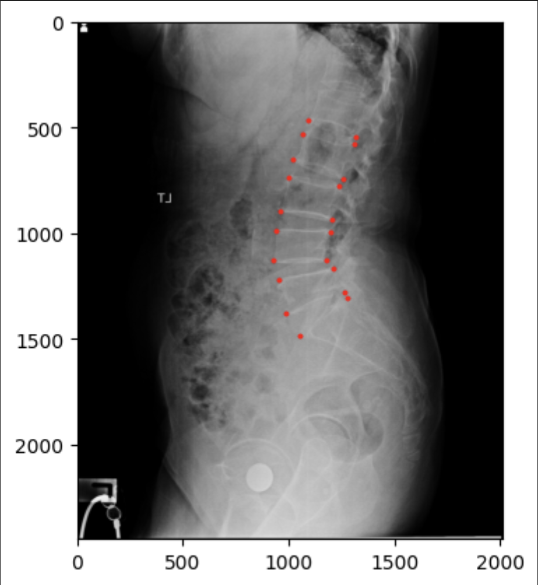
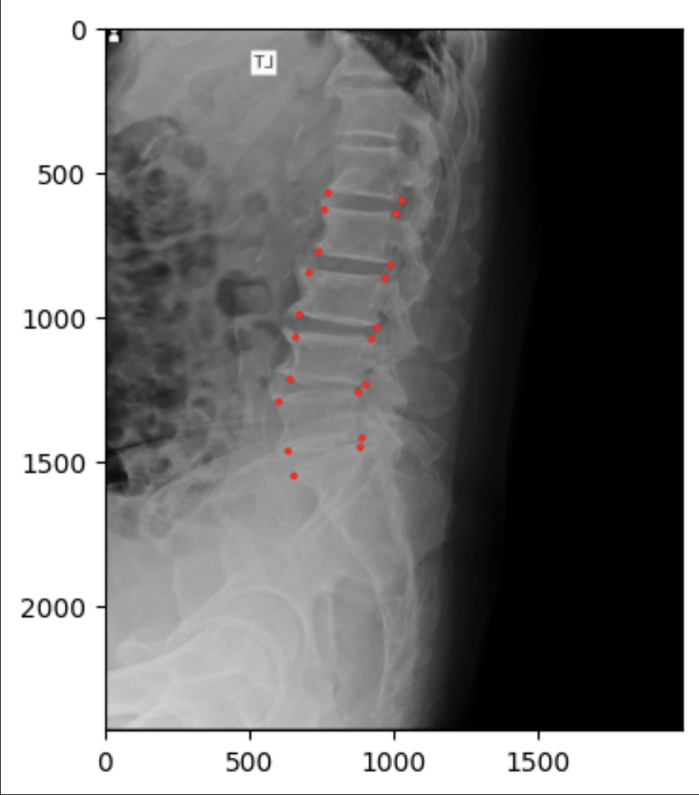
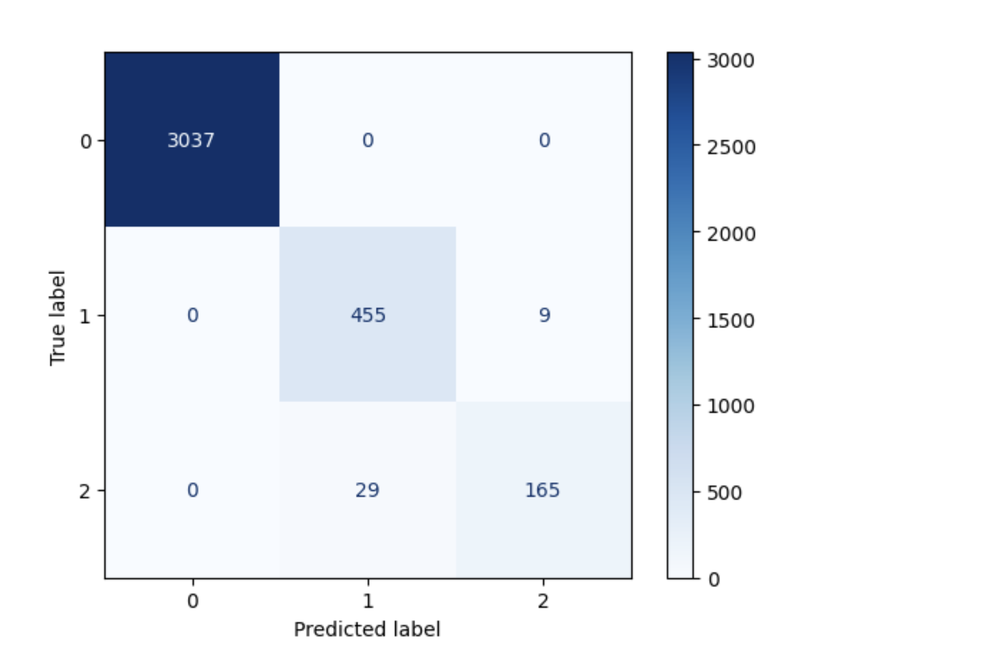
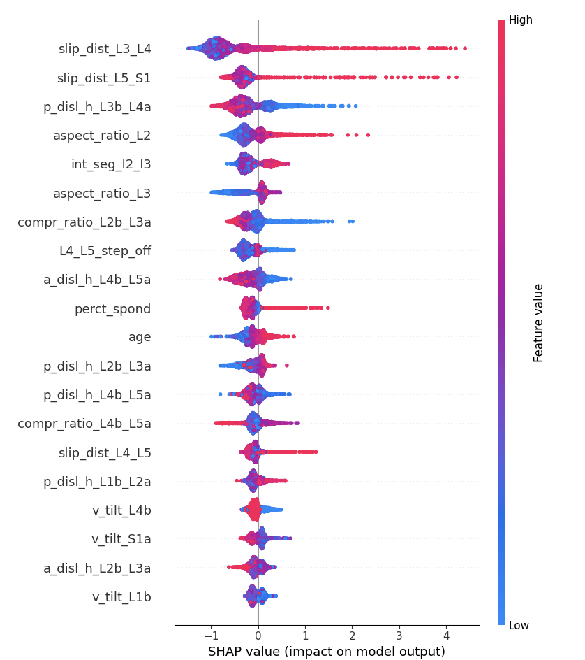
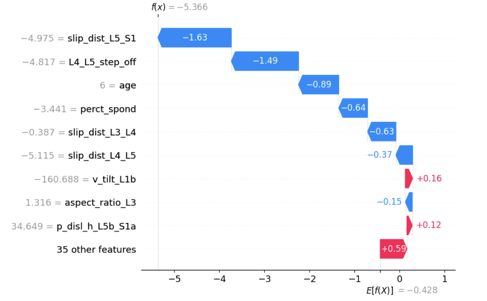

# Spondylolisthesis Classification Model 
## via Spine Geometric Feature Extraction

## Project Overview

This project leverages machine learning to classify spinal conditions using geometric features extracted from the **BUU-LSPINE dataset**. The goal is to accurately predict the presence of specific spinal displacements based on geometric coordinates and demographic data.

The model specifically classifies patients into three categories:

* **0:** Normal
* **1:** Anterolisthesis
* **2:** Retrolisthesis

## Demo Video

https://github.com/lavanyanigam/Spondylolisthesis-Vertebral-Detection/blob/branch-2/results/streamlit-demo-video.mov

## Dataset Details

**Source:** [BUU-LSPINE Dataset](https://services.informatics.buu.ac.th/spine/)

For this project, only the **LA (Lateral) views** were used. The dataset consists of a CSV file containing the labeled coordinates of the spine from **L1 to S1**.

### Original Dataset Distribution

Below is the breakdown of the raw data by condition and gender. *(Note: While the original dataset contains Laterolisthesis cases, this project's model focuses strictly on Normal, Anterolisthesis, and Retrolisthesis cases).*

| Diagnosis / Condition | Female (F) | Male (M) | Grand Total | Included in Model |
| --- | --- | --- | --- | --- |
| **Normal** | 1,856 | 1,123 | 2,979 |  (Class 0) |
| **Anterolisthesis** | 343 | 121 | 464 |  (Class 1) |
| **Retrolisthesis** | 94 | 100 | 194 |  (Class 2) |
| **Left Laterolisthesis** | 44 | 17 | 61 | no |
| **Right Laterolisthesis** | 43 | 26 | 69 | no |
| *Total Disorders* | *424* | *197* | *621* | - |


## Methodology

1. **Feature Engineering:** Geometric features (such as step-off distances, slip distances, compression ratios, and tilt angles) were systematically calculated using the L1-S1 coordinate data.
2. **Preprocessing:** Target labels were encoded to `[0, 1, 2]` to comply with XGBoost's multi-class requirements.
3. **Model Selection:** An **XGBoost Classifier** was trained and fine-tuned for this task.

### Model Hyperparameters

* `n_estimators`: 1000
* `learning_rate`: 0.05
* `max_leaves`: 500
* `random_state`: 1
* `eval_metric`: 'mlogloss'

---

## Model Performance

### Cross-Validation Accuracy

The model was evaluated using 5-fold cross-validation, yielding highly consistent results with an **average accuracy of 90.50%**.

* **Fold Accuracies:** `[0.9036, 0.8876, 0.9093, 0.9093, 0.9161]`

### Confusion Matrix Analysis

Based on the validation set, the model demonstrates excellent discriminative ability, particularly for identifying "Normal" cases.

* **Class 0 (Normal):** Flawless classification. 3,037 correct predictions with zero false positives or false negatives.

* **Class 1 (Anterolisthesis):** <br>
  

* **Class 2 (Retrolisthesis):** <br>
  

<br>

<div align="center">
  
</div>

- *Note: The model shows slight confusion between Class 1 and Class 2, which is expected given both conditions involve vertebral slippage in opposing directions.*


## Feature Importance

The model's decisions are heavily driven by localized geometric measurements of the lower lumbar spine (L4, L5) and sacrum (S1). Below are the top 6 most influential features driving the model's predictions.

| Rank | Feature | Importance Score | Description/Notes |
| --- | --- | --- | --- |
| **1** | `L4_L5_step_off` | 0.1592 | The most dominant predictor |
| **2** | `slip_dist_L3_L4` | 0.0991 | Measures forward/backward slip |
| **3** | `slip_dist_L4_L5` | 0.0758 | Measures forward/backward slip |
| **4** | `slip_dist_L5_S1` | 0.0672 | Critical junction for spondylolisthesis |
| **5** | `age` | 0.0418 | Demographic factor |
| **6** | `perct_spond` | 0.0416 | Percentage of spondylolisthesis |

*(Note: 38 additional geometric features contribute remaining fractional importance to the model, totaling 44 features).*

## Results

- The SHAP anaylysis for Retrolithesis class, similarly for other classes in Results


- SHAP waterfall plot for a specific patient showing exactly why the model predicted what it did for that person.


---

## Usage

**1. Clone the repository and install dependencies:**

```bash
pip install pandas numpy xgboost scikit-learn matplotlib

```

**2. Explore the code:**
You can view the full training process, feature extraction, and evaluation in the [Kaggle Notebook](https://www.kaggle.com/code/lavanyanigam/lumbar-spine-detection).
